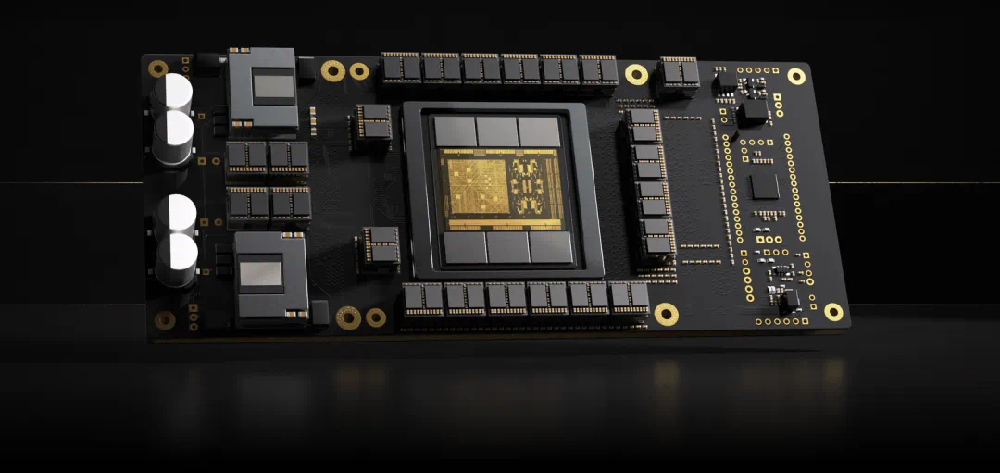
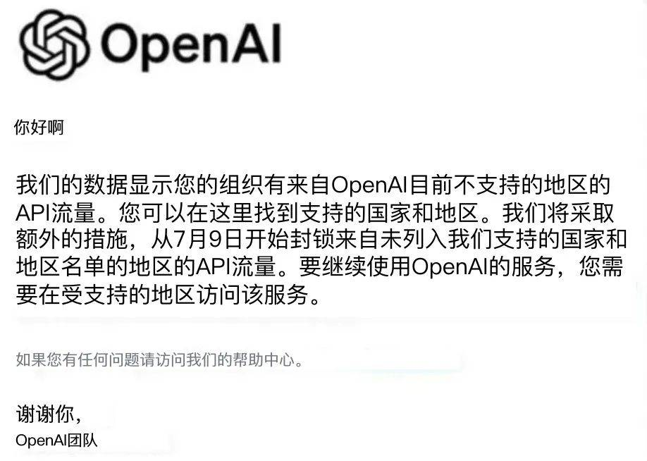
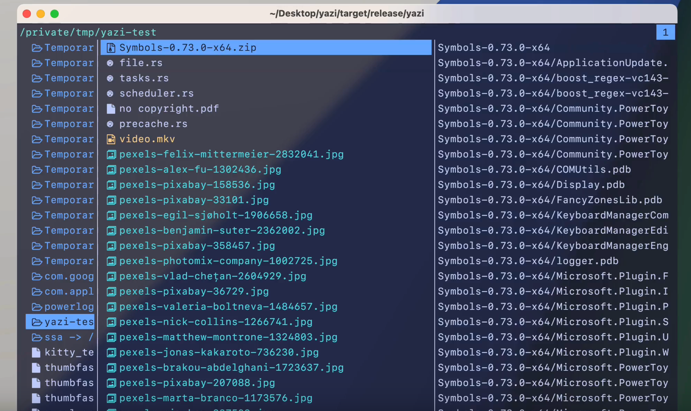
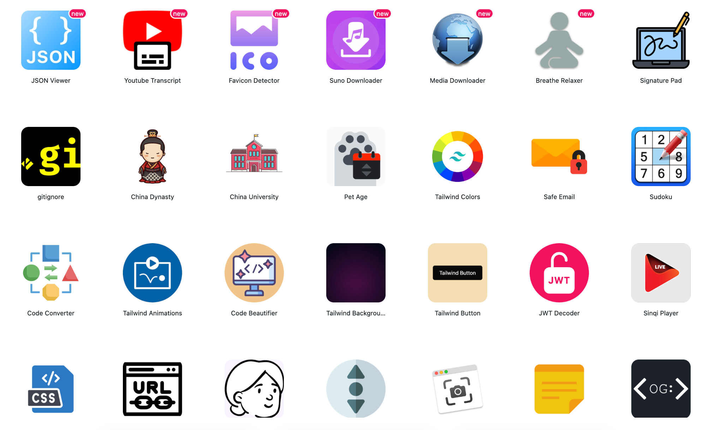

> **周刊内容**: 对一周内阅读的资讯或技术内容精品（个人向）进行总结，分类大致包含“业界资讯”、“技术博客”、“开源项目”和“工具分享”等。为减少阅读负担提高记忆留存率，每类下内容数一般不超过3条。 
> **更新时间**: 每周六（无特殊情况） 
> **历史收录**: [shawn-weekly](https://github.com/Xiaoxie1994/shawn-weekly)  
> **订阅方式**: 
> - **公众号**: 肖恩杂谈 
> 
>
> - **个人博客**: [肖恩的杂货店](https://www.shawnxie.top/categories/tf-weekly), [RSS订阅](https://www.shawnxie.top/feed.xml)
>
> **备注**: 内容收集&摘要生成基于[developer-hotspots-summary](https://github.com/Xiaoxie1994/developer-hotspots-summary)，之后经人工校验和调整后发布。

## 开篇图

> Steam夏季特卖开始啦！！！剁手入了歧路旅人1和2😁，补课一下！

## 业界资讯
- [史上最快AI芯片「Sohu」，速度10倍于B200，哈佛辍学生打造](https://www.jiqizhixin.com/articles/2024-06-26-5)

> 美国芯片创业公司Etched推出了一款名为Sohu的AI芯片，其运行大模型的速度比英伟达H100快20倍，比B200快10倍以上。Sohu是全球首款专用于Transformer计算的ASIC芯片，历时两年打造。Sohu芯片的FLOPS利用率超过90%，而使用TRT-LLM的GPU约为30%。Sohu仅支持Transformer推理，支持谷歌、Meta、微软、OpenAI、Anthropic等公司的模型。Etched位于加州库比蒂诺，由哈佛辍学生Gavin Uberti和Chris Zhu创立，目前团队只有35人。Sohu芯片预计将在今年三季度推向市场。    

- [OpenAI停服，国产大模型免费用！开发者Token自由实现了](https://jiqizhixin.com/articles/2024-06-25-7)

> OpenAI 突然宣布终止对中国提供 API 服务，国内开发者面临访问 GPT 等高水平大模型的困难。但随着开源大模型水平的提升，如 Qwen2、DeepSeek V2 等，硅基流动（SiliconFlow）推出了一站式大模型 API 平台 SiliconCloud，为开发者提供更快、更便宜、更全面的服务。硅基流动宣布 Qwen2 (7B)、GLM4 (9B)、Yi1.5（9B）等顶尖开源大模型永久免费，实现开发者的 “Token 自由”。SiliconCloud 聚合了多种开源大模型，支持开发者自由切换，降低 AI 应用开发门槛与成本。
> 
> 硅基流动致力于将大模型部署成本降低 10000 倍，通过性能优化，实现了大模型推理速度的大幅提升。SiliconCloud 的大模型 API 价格亲民，新用户可免费畅享 2000 万 Token。开发者对 SiliconCloud 的速度和体验给予了高度评价，认为其性能优化工作显著提升了大模型服务的输出速度和性价比。
> 
> 随着国产开源大模型的迭代和 SiliconCloud 的支持，超级个体开发者与产品经理迎来了开发 AI 应用的最佳时机。
 
## 技术博客
- [HTTP3为什么抛弃了经典的TCP，转而拥抱 QUIC 呢](https://juejin.im/post/7384266820466180148)
> 本文介绍了QUIC协议及其在HTTP/3中的应用。QUIC由Google设计，旨在解决TCP协议的不足，如队头阻塞问题。QUIC基于UDP协议，但增加了TCP的可靠性特性，如序号机制和丢包重传。QUIC的主要优势包括：
>
>1. 快速建立连接：QUIC不需要TCP的三次握手，可以实现0-RTT或1-RTT的快速连接建立；
>
>2. 数据流隔离：QUIC可以在一个连接中传输多个相互隔离的数据流，解决了TCP的队头阻塞问题；
>
>3. 连接不依赖IP：QUIC为每个连接分配连接ID，即使网络环境变化，连接仍然可以继续，而TCP连接依赖于IP和端口；
>
>4. 数据加密：QUIC使用TLS 1.3协议，确保数据传输的安全性。
>
>随着QUIC协议的推广，预计将对互联网传输技术产生深远影响，未来的互联网将由QUIC和HTTP/3主导。从HTTP/1到HTTP/2的演进用了16年时间，而QUIC的颠覆性改进可能需要更长时间来实现。

- [JDK 21 正式特性全面体验](https://juejin.im/post/7383311950174339110)
> Java 21，发布于2023年9月19日，是Java长期支持(LTS)版本之一，Oracle承诺至少8年的维护。该版本包含15个新特性，其中8个正式特性，6个预览特性，以及1个孵化阶段特性。重要的正式特性包括：
>
>1. JEP 431 - 有序集合接口：引入了\`SequencedCollection\`、\`SequencedSet\`和\`SequencedMap\`接口，提供了对有序集合的抽象支持，使得集合操作更加灵活；
>
>2. JEP 439 - 分代 ZGC：Z Garbage Collector（ZGC）增加了分代收集功能，提高了新生代对象的回收频率，从而优化了性能；
>
>3. JEP 440 - Record 模式：扩展了Java编程语言，简化了对Record对象的解构赋值，提高了代码的可读性和开发效率；
>
>4. JEP 441 - switch 模式匹配：switch表达式支持模式匹配，允许更复杂的数据访问方式，增强了Java的类型检查；
>
>5. JEP 444 - 虚拟线程：Java正式支持轻量级线程，大幅降低了高吞吐量应用的开发和维护成本，使得创建数以百万计的线程成为可能；
>
>6. JEP 449 - 废弃32位x86架构Windows移植：宣布将不再支持32位x86架构的Windows系统；
>
>7. JEP 451 - 准备禁用代理的动态加载：发出警告，为将来版本默认不允许动态加载代理做准备；
>
>8. JEP 452 - 密钥封装机制API：提供了KEM（Key Encapsulation Mechanism）API，增强了Java平台的安全性。
>
>Java 21的这些特性，特别是分代ZGC和虚拟线程，使得它成为一个值得在实际项目中尝试的版本。

- [无任何数学公式理解大模型基本原理](https://juejin.im/post/7383988944512483368)
> 大语言模型，如ChatGPT，本质上由参数文件和代码文件组成。参数文件包含神经网络的权重，而代码文件则是运行神经网络的编程语言，通常是Python。大模型训练是利用大量GPU资源对互联网数据进行压缩，形成对世界的理解。训练过程涉及参数的不断调整，以优化模型的预测能力。
>
>大模型的工作原理基于神经网络，通过预测序列中的下一个词来进行工作。例如，输入“中华人民共和国”，模型会预测下一个词并给出概率，形成完整的句子。这种能力是通过大量数据训练，调整神经元之间连接的权重来实现的。
>
>神经网络模仿人的大脑，通过感知器等基础单元处理输入信号并做出判断。权重和阈值是神经网络中的关键概念，它们决定了输入信号的重要性和触发输出的条件。通过训练，神经网络可以学习到数据的分布，从而进行有效的预测。
>
>Transformer架构是当前大模型的主流设计，其核心是自注意力机制，允许模型捕捉序列内元素之间的关系。训练过程包括文本的token化、嵌入向量、位置信息编码、自注意力机制的计算和归一化，以及前馈神经网络的处理。这些步骤使得模型能够理解和生成语言，实现复杂的语言处理任务。
>
>简而言之，大语言模型通过对海量数据的学习和训练，形成了强大的语言理解和生成能力，能够模拟人类的语言处理过程，并在各种应用场景中发挥作用。
 
## 开源项目 
- [sxyazi / yazi](https://github.com/sxyazi/yazi)

> Yazi是一个用Rust编写的**终端文件管理器**，基于非阻塞异步I/O。它旨在提供高效、用户友好和可定制的文件管理体验。Yazi具有以下特点：
>
> 1. 全异步支持：所有I/O操作都是异步的，CPU任务分布在多个线程中，充分利用可用资源。
>
>2. 强大的异步任务调度和管理：提供实时进度更新、任务取消和内部任务优先级分配。
>
>3. 内置支持多种图像协议：与Überzug++集成，覆盖几乎所有终端。
>
>4. 内置代码高亮和图像编码：结合预缓存机制，大幅加速图像和普通文件加载。
>
>5. 与fd、rg、fzf、zoxide等工具集成。
>
>6. Vim风格的输入组件和选择组件。
>
>7. 多标签支持，可滚动预览（适用于视频、PDF、归档、目录、代码等）。
>
>8. 批量重命名、视觉模式、文件选择器。
>
>9. 主题系统、自定义布局、回收站、CSI u等。

- [files-community / Files](https://github.com/files-community/Files)  

> Files是一款为Windows设计的终极**文件管理应用程序**。它具有时尚直观的设计，使浏览文件变得前所未有地容易。

- [Lissy93 / web-check](https://github.com/Lissy93/web-check)  

> Web-Check是一个全面的**开源情报工具**，用于分析任何网站。它提供了对网站内部运作的洞察，包括潜在的攻击向量、服务器架构分析、安全配置查看以及网站使用的技术等。目前，仪表板显示的信息包括IP信息、SSL证书链、DNS记录、cookies、headers、域名信息、搜索爬虫规则、页面地图、服务器位置、重定向记录、开放端口、traceroute、DNS安全扩展、网站性能、追踪器、相关主机名和碳足迹等。该工具旨在帮助用户轻松理解、优化和保护他们的网站。

## 网站推荐
-  [sinqi tools](https://sinqi.tools/zh)

> SinQi 是一个面向 Web 开发人员和设计人员的**精致工具集合**，旨在满足罕见和不常见的需求。
> 
> 它提供了多种独特工具，如 Logo 生成器、QRCode 生成器、图像颜色提取器、滚动文字效果生成器、占位图像生成器等。这些工具简洁无广告，界面干净，重点突出，所有操作均在本地执行，数据也存储在本地。SinQi 支持多平台，包括 PWA、桌面软件、APP、浏览器和 VSCode 扩展等。SinQi 即将推出更多实用工具，如代码图像生成器、日历、时钟、计时器、闹钟、秒表、倒计时、查询工具（Whois、DNS、URL、IP 等）、图案生成器（渐变、三角形、波浪、旭日图案等）。
> 
>此外，还有许多其他实用工具，如决策器、图像编辑器、虚拟键盘、BMI 计算器、密码生成器、贷款计算器、关系计算器、计数器、各种图案生成器、世界时钟、屏幕录像机、视频摄像头、语音录像机等。

## 学习资源
- [EbookFoundation / free-programming-books](https://github.com/EbookFoundation/free-programming-books)
> EbookFoundation的free-programming-books项目是一个收录了大量**免费编程书籍**资源的公共仓库。这些资源被分为不同的类别，包括按编程语言和主题分类的英文书籍、其他语言的书籍、速查表、免费在线课程、交互式编程资源、问题集和竞赛编程、播客和屏幕录制，以及编程游乐场等。

- [donnemartin / system-design-primer](https://github.com/donnemartin/system-design-primer) 
> 本项目帮助工程师学习如何设计大型系统并准备**系统设计面试**。该项目提供了一个资源的组织集合，包括Anki记忆卡片，涵盖从基础概念到高级主题的各个方面，如可扩展性、性能、延迟与吞吐量、CAP定理、一致性模式、可用性模式、负载均衡、缓存策略、异步处理等。此外，还提供了学习指南和面试准备材料，包括面向对象设计问题和解决方案。

- [mehdihadeli / awesome-software-architecture](https://github.com/mehdihadeli/awesome-software-architecture) 
> 精选的**软件架构、模式和原则**的学习资源列表。这个仓库会持续更新，旨在帮助人们共同提高知识水平。它包含了多个主题，如软件架构、Actor 模型架构、算法、Clean Architecture、洋葱架构、六边形架构、垂直切片架构、事件驱动架构、面向服务的架构、领域驱动设计、数据驱动设计、CQRS、微服务、模块化单体、架构设计原则、设计模式、云设计模式、云最佳实践、云原生、平台即服务、基础设施即服务、DevOps、反向代理-负载均衡、服务发现和注册、服务网格、面向对象设计、系统设计、扩展、背压、代码清洁、抽象、设计最佳实践、反模式、最终一致性、消息、分布式事务、分布式锁定、RESTful API 设计、gRPC、缓存、函数式编程、并发、分片、重构、NoSQL、关系数据库、Microsoft Azure 云、建模、开源、代码审查、面试、架构决策记录 (ADR)、微前端等。

## 其他值得看
-  [科技爱好者周刊（第 306 期）](https://www.ruanyifeng.com/blog/2024/06/weekly-issue-306.html)
> 本期探讨了**信息上瘾**的现象，将其与糖上瘾进行了类比。文章指出，信息的低成本生产和传播，以及其对大脑多巴胺分泌的刺激，使得人们容易对信息产生依赖，类似于对糖的渴望。这种依赖不仅导致垃圾信息的泛滥，还可能降低人们的思考水平，导致思维“发胖”。作者强调，健康生活需要我们减少对糖和垃圾信息的摄入，并提倡自我克制以防止信息上瘾。
>
> 除了信息上瘾的讨论，本期周刊还涵盖了多个科技动态，包括英国火车站的情绪检测摄像头、PCIe 7.0版接口的光纤数据传输技术、鹦鹉视频聊天实验、以及大脑植入设备治疗癫痫的案例。这些内容展示了科技在不同领域的最新进展。
>
> 此外，周刊还介绍了一些有用的工具和资源，如Figma Slides幻灯片制作工具、Planka项目管理软件、Flow Epub阅读器等。在AI领域，提到了Logo Galleria在线AI徽标制作器和React组件的AI生成器等创新应用。
>
> 最后，文章以一些言论和往年回顾作为结束，提供了对科技、工作文化和个人效率的深刻见解。整体而言，第306期周刊为读者提供了一个关于科技趋势、工具资源以及个人发展的全面视角。        

- [AIGC Weekly #77](https://quail.ink/op7418/p/aigc-weekly-77)
> Anthropic 推出了 Claude 3.5 Sonnet，一款在可解释性方面有显著投入的LLM，性能超越了前代，并且提供了免费使用。Runway 发布了 Gen-3 视频生成模型，以其高质量视频和美学表现受到关注。Deepseek 发布了 DeepSeek-Coder-V2 代码模型，开源且性能优异。Ilya 离开 Open AI 后成立了 SSI，专注于安全超级智能。Meta 发布了四个开源模型，包括多模态的 Meta Chameleon 和针对不同领域的专业模型。此外，报道还提到了其他 AI 领域的新产品和动态，如快手可灵的视频生成模式、Midjourney 的新功能、谷歌的 Gemini 1.5 模型等。产品推荐部分介绍了 Genspark、Hedra、Dot、Otto 和 Playmaker Document AI 等 AI 应用。精选文章包括 Andrej Karpathy 的新课程 LLM 101、Lex Fridman 对 Perplexity CEO 的访谈等。最后，报道还涵盖了一些重点研究，如大规模药物分子量子化学数据集、StyleGAN Inversion 技术、长视频问答测试等。
